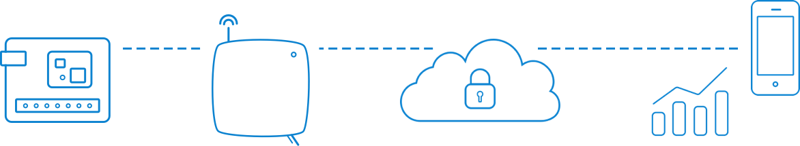

---?color=linear-gradient(to right, #c02425, #f0cb35)
@title[Introduction]

@snap[west text-25 text-bold text-white]
LoRa/TheThingsNetwork *Formation 30 Janvier 2019*
@snapend

@snap[south-west byline text-white text-06]
De l'objet à la donnée...
@snapend

---
@title[The Things Network]

## The Things Network

The Things Network permet à des *objets basse consommation* d'utiliser des *passerelles longue portée* pour se connecter à un réseau
open-source décentralisé afin d'échanger des données avec des *applications*.

  

@title[LoRaWAN]
+++?image=template/img/LoRaWAN-Overview.png&size=65%

---
@title[Radio]

@snap[north-west]
Radio
@snapend

@snap[west list-content-verbose span-100] 
 
@ul

- Les **protocoles radio** sont définis par [Lora Alliance](https://lora-alliance.org/)  

- Les **Bandes de Fréquences** utilisées par LoRa en Europe sont 863-870 MHz. Ces fréquences sont utilisables par tous, sans conditions de license.

- Les **Cycles d'utilisation** imposés par le régulateur sont de 1% voire 0.1% selon les sous-bandes. Ceci implique d'avoir un réseau performant qui optimise l'envoi des données sur les canaux les moins chargé. Les développeurs doivent optimiser les messages transmis et les fréquences d'émission.

@ulend
@snapend
---

@title[Radio]
## Modulation et taux de transfert 

@snap[west list-content-verbose span-100] 
 
@ul

-La **modulation*** LoRa est basée sur une technologie chirp d'étalement de spectre permettant un bon fonctionnement dans le cas de canaux bruités, de rebonds multiples, d'effet Doppler et ce même à basse puissance.

-Le **taux de transfert** dépend de la largeur de bande utilisée et du facteur d'étalement.
Les largeurs des bandes LoRa sont de 125 kHz, 250 kHz ou 500 kHz, selon la région et le plan de fréquence.
Le facteur d'étalement est choisit par le terminal. Il influence le temps utilisé pour transmettre une trame
@ulend
@snapend

    The Data Rate Story: There are three knobs you can turn: transmission power, bandwidth and spreading factor. If you lower the tx power, you’ll save battery, but the range of the signal will obviously be shorter. The other two knobs combined form the data rate. This determines how fast bytes are transmitted. If you increase the data rate (make the bandwidth wider or the spreading factor lower) you can transmit those bytes in a shorter time. For those, the calculation is approximately as follows: Making the bandwidth 2x wider (from BW125 to BW250) allows you to send 2x more bytes in the same time. Making the spreading factor 1 step lower (from SF10 to SF9) allows you to send 2x more bytes in the same time. Lowering the spreading factor makes it more difficult for the gateway to receive a transmission, as it will be more sensitive to noise. You could compare this to two people taking in a noisy place (a bar for example). If you’re far from each other, you have to talk slow (SF10), but if you’re close, you can talk faster (SF7)

---

---?include=template/md/split-screen/PITCHME.md

---?include=template/md/sidebar/PITCHME.md

---?include=template/md/list-content/PITCHME.md

---?include=template/md/boxed-text/PITCHME.md

---?include=template/md/image/PITCHME.md

---?include=template/md/sidebox/PITCHME.md

---?include=template/md/code-presenting/PITCHME.md

---?include=template/md/header-footer/PITCHME.md

---?include=template/md/quotation/PITCHME.md

---?include=template/md/announcement/PITCHME.md

---?include=template/md/about/PITCHME.md

---?include=template/md/wrap-up/PITCHME.md

---?image=template/img/presenter.jpg
@title[The Template Docs]

@snap[north-west sign-off]
### **Now it's @color[#e58537](your) turn.**
 
#### Quickstart your next slide deck with @size[1.4em](The GitPitch Template).
@snapend

@snap[south docslink text-gold span-100]
For supporting documentation see the [The Template Docs](https://gitpitch.com/docs/the-template)
@snapend
